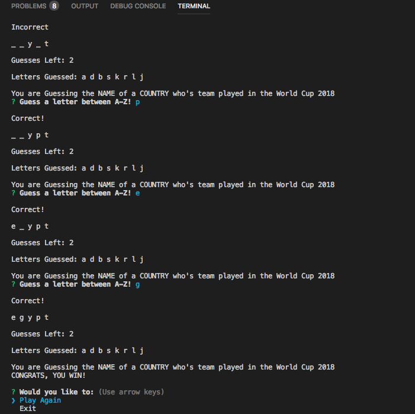

# WORD-GUESS-CLI

A Command Line based Word Guess Game built on Node.js app that incorporates objects, user-input, and constructors. Keeping on the theme of a command line application, all the words to be guessed are randomly picked by the computer. 
The app uses the inquirer node module to collect user inputs.

Challenge: 

        * Choose from World Cup 2018 participating Countries

        * to be guessed is the country randomly picked by the computer 

        * one letter at a time the palyer will have 10 chances before losing the game. 

Refer to the screenshot below for GAME LOGIC: 

